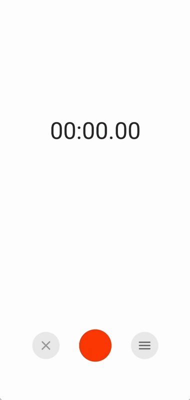

# Android Voice Recorder

A minimalist voice recorder for android using Kotlin with a live waveform reflecting voice amplitude. Using Android Room Library to store and query records metadata.

## Demo

   

## Features

- Record audio files
- Control player speed
- Rename and delete records
- BottomSheetLayout to edit file names
- Search bar with files filter

## Technologies

- [Android Room Library]() to manage audio files locations and metadata
- [Material Design]()